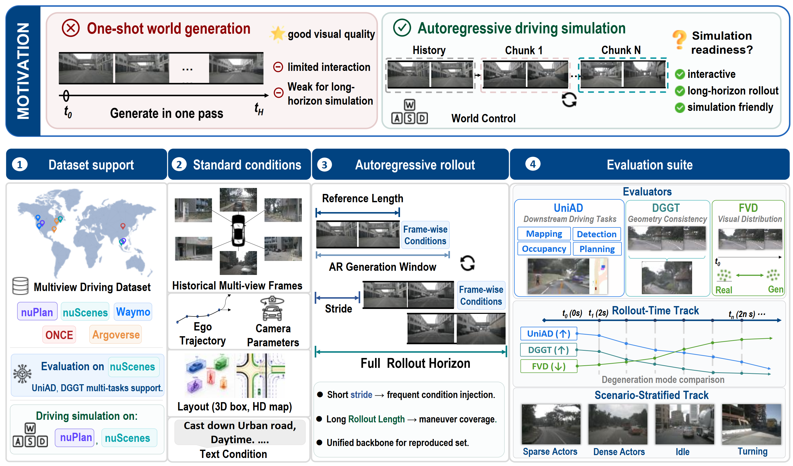

# Interactive Driving Generation Benchmark

This repository provides a modular benchmark stack for **multi-view autonomous-driving video generation** and **closed-loop generative simulation**. It is designed to connect generation outputs with several complementary evaluation paths:

- model-side rolling generation and preview;
- few-step / self-forcing autoregressive generation;
- downstream perception, mapping, occupancy, and planning evaluation;
- geometry-aware video evaluation;
- nuPlan-based closed-loop simulation;
- lightweight interactive visual debugging.

The repository is organized as a set of suite-level modules. Each top-level suite owns its own README, environment assumptions, configs, and entry points.

<p align="center">
  <!-- TODO: add benchmark overview figure or generated video teaser -->
  
</p>

## Suite overview

| Suite | README | Purpose |
| --- | --- | --- |
| `DWM/` | [DWM/README.md](DWM/README.md) | OpenDWM-style generation, rolling preview, and generation-result export. |
| `Self_Forcing/` | [Self_Forcing/README.md](Self_Forcing/README.md) | ODE-pair generation, ODE distillation, and DMD / self-forcing training for few-step autoregressive generation. |
| `UniADBench/` | [UniADBench/README.md](UniADBench/README.md) | UniAD-style downstream evaluation for generated driving videos. |
| `DGGT/` | [DGGT/README.md](DGGT/README.md) | Geometry-aware evaluation for generated videos using DGGT-style pose, view-consistency, and rendering metrics. |
| `nuplan/` | [nuplan/README.md](nuplan/README.md) | nuPlan-based generative simulation interface with predefined ego-trajectory rollout. |
| `EasyTry/` | [EasyTry/README.md](EasyTry/README.md) | Gradio-based interactive rolling-generation demo and debugging interface. |

## Typical workflow

This benchmark is intended to be used as a modular pipeline rather than a single monolithic script.

```text
DWM / Self-Forcing generator
        │
        ├── generated videos / preview arrays / tokens
        │
        ├── UniADBench  -> detection, map, occupancy, motion, planning metrics
        │
        ├── DGGT        -> geometry-aware consistency and view-synthesis metrics
        │
        ├── EasyTry     -> interactive visual inspection
        │
        └── nuPlan      -> closed-loop generative simulation
```

Users may evaluate videos generated by the included DWM / Self-Forcing code, or adapt the input converters to evaluate outputs from another driving video generator.

## Environment overview

The suites intentionally use separate environments because generation, geometry evaluation, nuPlan simulation, and UniAD evaluation rely on different community codebases. A single universal environment is not recommended.

| Suite | Suggested environment | Reference file or guide |
| --- | --- | --- |
| DWM generation | [OpenDWM](https://github.com/SenseTime-FVG/OpenDWM)-style generation environment | `requirements_dwm.txt` |
| Self-Forcing generation | DWM-compatible generation environment | `requirements_dwm.txt` |
| EasyTry demo | DWM-compatible generation environment | `requirements_dwm.txt` |
| UniADBench | [Bench2DriveZoo / UniAD](https://github.com/Thinklab-SJTU/Bench2DriveZoo)-compatible environment | `requirements_uniad.txt` plus the [Bench2DriveZoo setup guide](https://github.com/Thinklab-SJTU/Bench2DriveZoo/tree/uniad/vad) |
| DGGT | [DGGT](https://github.com/xiaomi-research/dggt)-compatible geometry environment | `requirements_dggt.txt` |
| nuPlan interface | DWM generation environment + [nuPlan devkit](https://github.com/motional/nuplan-devkit) | `requirements_dwm.txt` plus the [official nuPlan devkit](https://github.com/motional/nuplan-devkit/blob/master/docs/installation.md) |

Before running DWM-side code, expose the corresponding source tree:

```bash
export PYTHONPATH=$PWD/DWM/src:$PYTHONPATH
```

For Self-Forcing:

```bash
export PYTHONPATH=$PWD/Self_Forcing/src:$PYTHONPATH
```

For suites that wrap external projects, such as UniAD, DGGT, or nuPlan, also follow the path requirements described in the suite-level README.

## Data and checkpoints

This repository contains code, configs, converters, and benchmark wrappers. Large datasets and model checkpoints are not included in the repository.

### Required datasets

| Resource | Used by | Link or source | Notes |
| --- | --- | --- | --- |
| nuScenes dataset + 12Hz annotation files | DWM, Self-Forcing, EasyTry, UniADBench, DGGT | [nuScenes](https://www.nuscenes.org/download), [12Hz annotations](https://pan.baidu.com/s/107dd2wyuG-7tnIFDgh5mCg?pwd=4930) | The full benchmark stack assumes the 12Hz nuScenes-style annotation format. |
| nuPlan DBs, maps, and sensor blobs | nuPlan interface | [Official nuPlan dataset](https://www.nuscenes.org/nuplan) | Required only for the nuPlan closed-loop interface and trajectory-controlled simulation. |

### Checkpoints

| Checkpoint / model family | Used by | Link or source | Notes |
| --- | --- | --- | --- |
| DreamForge reproduction checkpoint | DWM, EasyTry, UniADBench, DGGT | [Download](https://pan.baidu.com/s/1p2iU5Vwc09pkgzoVV1qJUw?pwd=4930) | Reproduced DWM baseline. See the corresponding DWM config folder for the exact inference setting. |
| LiVE reproduction checkpoint | DWM, EasyTry, UniADBench, DGGT | [Download](https://pan.baidu.com/s/1eOiYTQN6LjD-uEkP2kH75Q?pwd=4930) | Reproduced DWM baseline. See the corresponding DWM config folder for the exact inference setting. |
| DFoT / rolling inference checkpoint | DWM, EasyTry, UniADBench, DGGT | [Download](https://pan.baidu.com/s/1RcyBVsyqd0POx9DdOvEkyA?pwd=4930) | Uses the same checkpoint family as the corresponding DWM reproduction; the difference is the inference mode. |
| Self-Forcing teacher / student checkpoints | Self-Forcing, DGGT | [Download](https://pan.baidu.com/s/1CWN1YOd80ZXsG47RslC-cQ?pwd=4930) | Used for self-forcing rollout and geometry-oriented evaluation. |
| UniAD official Stage-2 E2E checkpoint | UniADBench | [uniad_base_e2e.pth](https://github.com/OpenDriveLab/UniAD/releases/download/v1.0.1/uniad_base_e2e.pth) | Place it under the UniAD checkpoint directory used by the UniADBench configs, for example `UniAD/ckpts/`. |
| DGGT official Waymo checkpoint | DGGT | [model_latest_waymo.pt](https://huggingface.co/xiaomi-research/dggt/resolve/main/model_latest_waymo.pt?download=true) | Official DGGT inference model trained on Waymo. Place it according to the DGGT config, for example `pretrained/model_latest_waymo.pth`. |
| I3D / FVD checkpoint | DWM metrics, UniADBench video metrics | [i3d_pretrained_400.pt](https://github.com/songweige/TATS/blob/6c8e1a133ef5a0b32c37f0123e833a128e8fbd91/tats/fvd/i3d_pretrained_400.pt) | This follows the OpenDWM external FVD dependency under `externals/TATS/tats/fvd/`. |

DWM-related checkpoints are organized by reproduced method and inference setting. Please refer to [`DWM/README.md`](DWM/README.md) and the corresponding config folder for the exact checkpoint path, config file, and inference command.

All config files use template paths. Update dataset roots, generated-output directories, checkpoint paths, GPU IDs, and output directories before running a pipeline.
## Configuration convention

Configuration files are stored beside the suite that consumes them:

```text
DWM/configs/                  DWM training, preview, and rolling-generation configs
Self_Forcing/configs/         ODE generation, ODE training, and DMD/self-forcing configs
UniADBench/cfg/               UniADBench conversion and evaluation configs
nuplan/sim_tools/configs/     nuPlan simulation and generation configs
EasyTry/rolling_demo.json     Gradio demo configuration
```

Most launch scripts are intentionally thin wrappers. They should be treated as templates: update local paths and checkpoint names before running them on a new machine.

## Acknowledgements

This repository builds on several open-source projects and evaluation stacks, including:

- [OpenDWM](https://github.com/SenseTime-FVG/OpenDWM)
- [Bench2Drive / Bench2DriveZoo](https://github.com/Thinklab-SJTU/Bench2DriveZoo)
- [UniAD](https://github.com/OpenDriveLab/UniAD)
- [DGGT](https://github.com/xiaomi-research/dggt)
- [nuPlan devkit](https://github.com/motional/nuplan-devkit)

Please also follow the license and citation requirements of the upstream projects.
